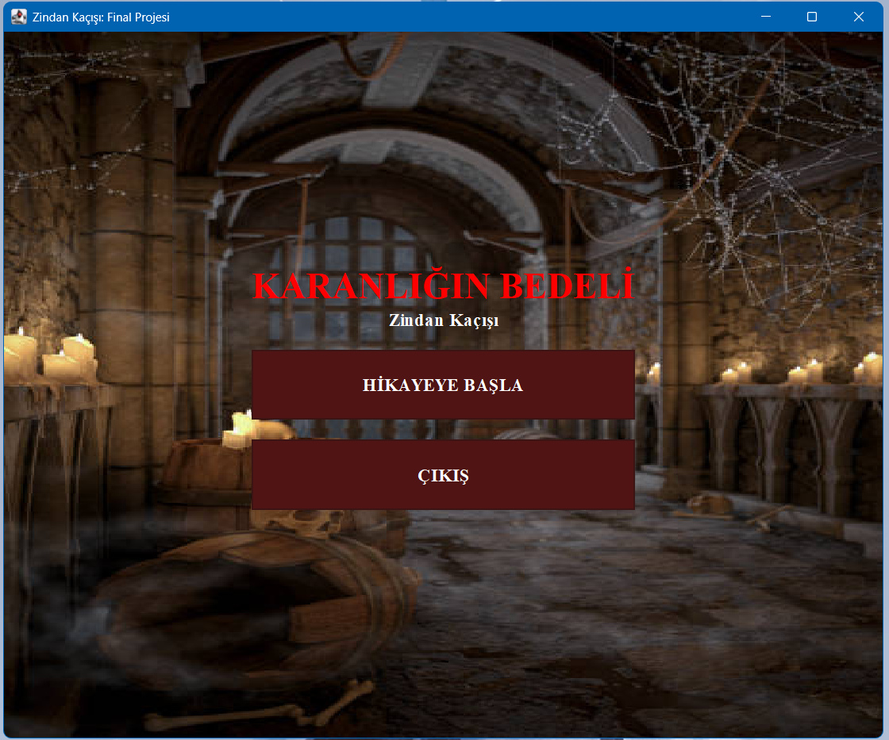
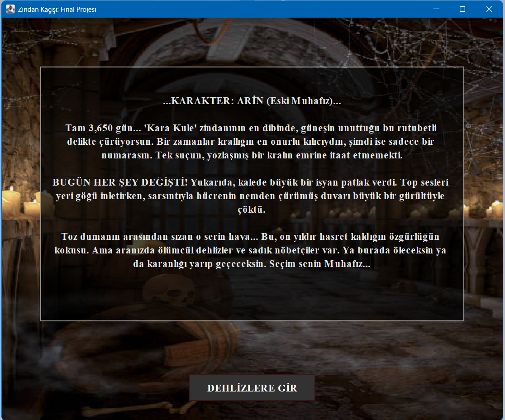
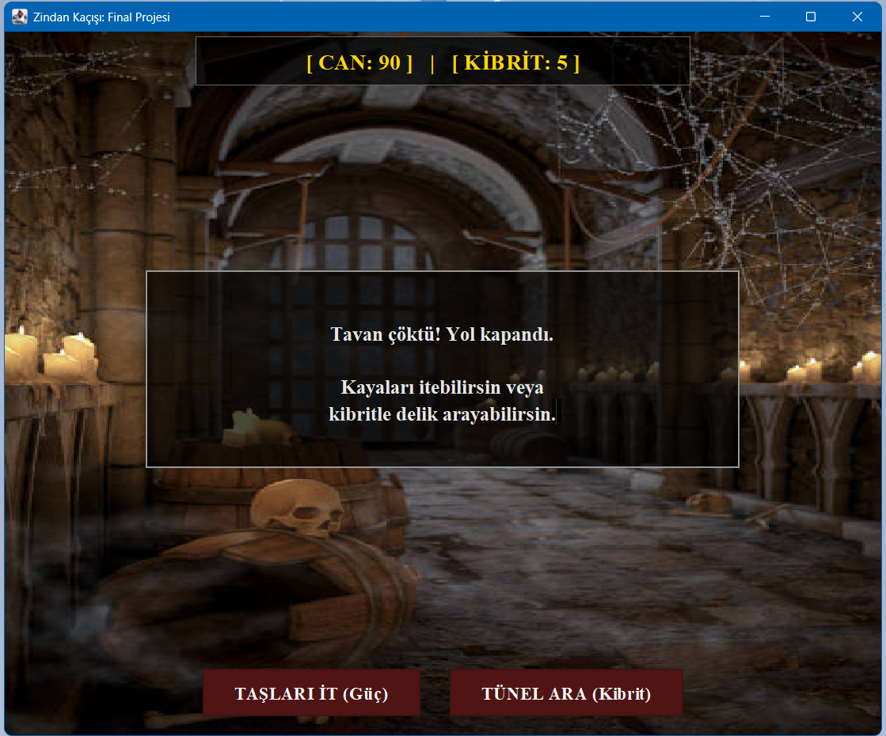
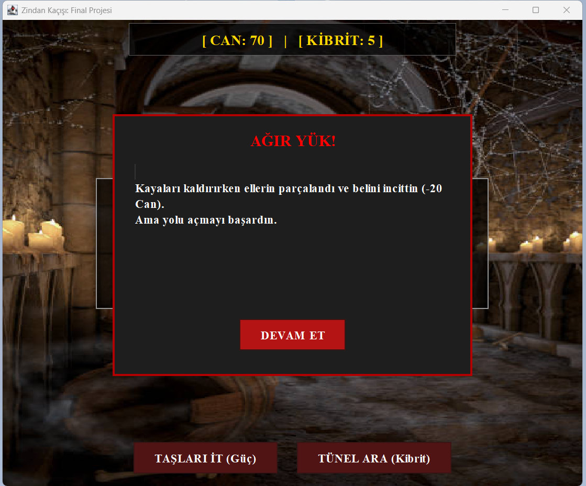

# 🏰 Karanlığın Bedeli: Zindan Kaçışı

Bu proje, Java programlama dili ve Swing kütüphanesi kullanılarak geliştirilmiş, hikaye tabanlı ve görsel arayüze sahip bir macera oyunudur.

---

## 🎯 Projenin Amacı
**Bu proje, eğitim amaçlı geliştirilmiştir.** Java programlama dilinde;
* Nesne Yönelimli Programlama (OOP) prensipleri,
* Swing GUI (Grafik Arayüz) tasarımı,
* Olay yönetimi (Event Handling),
* Dosya işlemleri (Görsel yükleme)
konularındaki yetkinlikleri pekiştirmek ve örnek bir masaüstü uygulaması ortaya koymak amacıyla hazırlanmıştır.

---

## 📖 Hikaye
Eski bir muhafız olan Arin, yozlaşmış krala itaat etmediği için 10 yıldır Kara Kule zindanında tutsaktır. Kalede çıkan bir isyan sonucu hücresinin duvarı yıkılır. Arin'in önünde iki seçenek vardır: Ya bu fırsatı değerlendirip özgürlüğe koşacak ya da dehlizlerin karanlığında kaybolacaktır.

---

## 🕹️ Oynanış Özellikleri
* **Seçim Odaklı Senaryo:** Verdiğiniz kararlar (Sessiz gitmek, savaşmak, kaçmak) oyunun gidişatını etkiler.
* **Kaynak Yönetimi:** Can barı ve Kibrit sayısı hayatta kalmanız için kritiktir.
* **Dinamik Arka Plan:** Bulunduğunuz duruma göre (Zindan veya Orman) arka plan görseli değişir.
* **Görsel Geri Bildirim:** Hasar aldığınızda veya kurtulduğunuzda özel uyarı pencereleri ile bilgilendirilirsiniz.

---

## 📸 Oyun Görselleri
| Ana Menü | Hikaye Başlangıcı |
| :---: | :---: |
|  |  |

| Karar Anı | Karar Sonucu |
| :---: | :---: |
|  |  |

<h3 align="center">Oyun Sonu</h3>

  

---

## 🚀 Kurulum ve Çalıştırma
Proje dosyalarını bilgisayarınıza indirdikten sonra:
1.  `ZindanKacisiOyunu.java`, `zindan_bg.jpg` ve `orman_bg.jpg` dosyalarının **aynı klasörde** olduğundan emin olun.
2.  Herhangi bir Java IDE (Eclipse, IntelliJ, VS Code) veya terminal üzerinden `ZindanKacisiOyunu.java` dosyasını derleyip çalıştırın.

---

## 🛠️ Kullanılan Teknolojiler
* **Dil:** Java (JDK 8+)
* **Arayüz:** Java Swing & AWT
* **IDE:** Eclipse

---
*Bu proje eğitim amaçlı geliştirilmiştir.*
